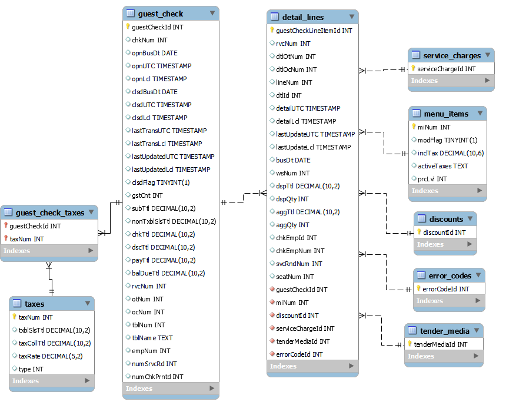

### Desafio 1

#### Questão 1
Para o desafio 1 temos que um endpoint nos devolve um arquivo JSON, `ERP.json`

De forma discursiva o JSON apresentado apresenta um aninhamento de objetos referentes aos pedidos de uma loja.
- Nível inicial temos informações referente a requisição e um atributo contendo um *Array* de objetos de pedidos, neste exemplo há apenas um pedido, porém como temos um *Array* na prática provavelmente este JSON teria uma lista de pedidos. 
  - Os objetos de pedidos podemos enxergá-los como o segundo nível no JSON, estes contém diversos atributos referentes ao pedido do usuário, como tempos, valores, informações da mesa e demais informações que possam ser úteis. Cada objeto de pedido há dois atributos que também nos devolvem uma lista aninhada para outros JSONs `taxes` e `detailLines`.
    - `taxes` se refere provavelmente a tributações referentes ao pedido.
    - `detailLines` se refere aos itens solicitados pelo cliente neste pedido. Aqui temos também uma coletânea de dados referentes ao item e um objeto `menuItem`, diferentemente das outras aninhações, este objeto não é ligado a uma lista, mas sim a um único registro JSON.
      - `menuItem` Informações do item de menu em que o pedido foi realizado.

Podemos fazer palpites do que significa os principais atributos:
~~~python
{
    "curUTC": "2024-05-05T06:06:06", # Data da requisição
    "locRef": "99 CB CB", # Referência de localização da Unidade
    "guestChecks": [ # Lista contendo pedidos
        {
            "guestCheckId": 1122334455, # ID do pedido
            "chkNum": 1234, # Número do pedido
            # A seguir temos diversas datas inerentes a abertura, fechamento e transações do pedido
            # Temos também a transformação das datas para a zona local
            "opnBusDt": "2024-01-01", 
            "opnUTC": "2024-01-01T09:09:09",
            "opnLcl": "2024-01-01T06:09:09",
            "clsdBusDt": "2024-01-01",
            "clsdUTC": "2024-01-01T12:12:12",
            "clsdLcl": "2024-01-01T09:12:12",
            "lastTransUTC": "2024-01-01T12:12:12",
            "lastTransLcl": "2024-01-01T09:12:12",
            "lastUpdatedUTC": "2024-01-01T13:13:13",
            "lastUpdatedLcl": "2024-01-01T10:13:13",
            ###
            "clsdFlag": true, # Indica se o pedido está fechado ou não
            "gstCnt": 1, # Quantidade de clientes
            "subTtl": 109.9, # Sub total deste pedido
            "nonTxblSlsTtl": null,
            "chkTtl": 109.9, # Total do pedido
            "dscTtl": -10, # Desconto recebido
            "payTtl": 109.9, # Pagamento total realizado
            "balDueTtl": null, # Total devido
            "rvcNum": 101,
            "otNum": 1,
            "ocNum": null,
            "tblNum": 1, # Número da mesa
            "tblName": "90", # Nome da mesa 
            "empNum": 55555, # Número do colaborador de atendimento
            "numSrvcRd": 3,
            "numChkPrntd": 2, # Número de contas impressas
            "taxes": [ # Lista de taxas aplicadas
                {
                    "taxNum": 28, # Id do objeto de taxa
                    "txblSlsTtl": 119.9, # Total de vendas
                    "taxCollTtl": 20.81, # Total de impostos coletados
                    "taxRate": 21, # Taxa de imposto
                    "type": 3 # Tipo da taxa
                }
            ],
            "detailLines": [ # Lista de detalhes do pedido
                {
                    "guestCheckLineItemId": 9988776655, # Id de detalhe
                    "rvcNum": 123,
                    "dtlOtNum": 1,
                    "dtlOcNum": null,
                    "lineNum": 1,
                    "dtlId": 1,
                    # Datas inerentes ao detalhe 
                    "detailUTC": "2024-01-01T09:09:09",
                    "detailLcl": "2024-01-01T06:09:09",
                    "lastUpdateUTC": "2024-11-01T10:10:10",
                    "lastUpdateLcl": "2024-01-01T07:10:10",
                    "busDt": "2024-01-01",
                    ###
                    "wsNum": 7,
                    "dspTtl": 119.9,
                    "dspQty": 1,
                    "aggTtl": 119.9,
                    "aggQty": 1,
                    "chkEmpId": 10454318,
                    "chkEmpNum": 81001,
                    "svcRndNum": 1,
                    "seatNum": 1,
                    "menuItem": { # Objeto referente ao item do Menu solicitado
                        "miNum": 6042, # Id do item de menu
                        "modFlag": false,
                        "inclTax": 20.809091, 
                        "activeTaxes": "28",
                        "prcLvl": 3
                    }
                }
            ]
        }
    ]
}
~~~

Reiterando que o significado dos atributos se trata de uma estimativa/palpite uma vez que os nomes dos atributos e dados inerentes ao JSON se encontram abreviados, se torna necessário uma visualização mais detalhada das regras negociais para inferir com exatidão o que cada dado se refere.

O JSON apresenta atributos inteiros, *floats*, booleanos e *strings*, isso se torna essencial na próxima questão para a criação das tabelas do banco de dados, em que necessitamos atribuir os tipos para cada atributo.

#### Questão 2

Para a resolução da questão 2 vamos utilizar o código em python `database_creation.py`, presente na pasta deste README. Temos neste arquivo a criação da estrutura de tabelas com a respectiva modelagem de dados apresentada pelo JSON.

#### Questão 3

Foi utilizado Python 3.11 instalado a partir do gerenciador de pacotes Anaconda. Foi criado um ambiente virtual para a realização das tarefas, garantindo a integridade de versões e pacotes python.

Inicialmente as tabelas foram criadas utilizando o banco Sqlite por se tratar de um banco de dados local sem necessidade de uma instalação complexa. Porém para observarmos melhor o BD criado e inclusive gerar a imagem a seguir contendo estrutura de relacionamentos, as tabelas foram criadas em um ambiente MySQL, em que podemos utilizar da *feature* engenharia reversa para obter a imagem das relações.

O código forneceu uma correta criação do banco de dados contanto que seja a primeira criação do mesmo, se torna necessário também alterar as credenciais de acesso para o BD MySQL utilizado. Caso não seja desejado esses passos, basta alternar a criação do objeto conn para utilizar Sqlite novamente. Foi necessário também o uso do pacote `mysql-connector-python` instalado pelo comando `pip install mysql-connector-python`

Podemos visualizar o banco criado na imagem a seguir:

Gostaria de destacar alguns pontos de cuidado que foram tidos:
- Assumimos que um pedido pode possuir diversas taxas. E tais taxas podem estar vinculadas a diversos pedidos.
- Um pedido pode possuir diversos objetos de detalhe, tendo em vista que o JSON apresenta um *array* para este campo.
- Um objeto de detalhe tem diversas relações como comentado no contexto fornecido, as relações para estes objetos foram criadas como 1:N seguindo o padrão do objeto `menu_item`, como ele não se apresenta como *array*, foi suposto que haverá apenas 1 em cada `detail_lines`.
- Considerando essas relações devemos nos atentar a ordem de criação das tabelas para garantir a integridades das chaves estrangeiras.

