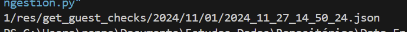
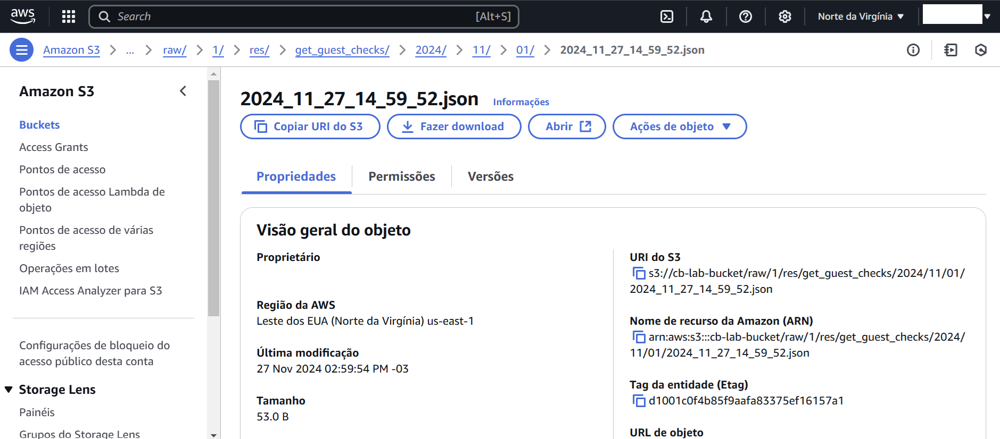

### Desafio 2

Temos os 5 *endpoints* fornecidos:
- /`bi`/getFiscalInvoice
- /`res`/getGuestChecks
- /`org`/getChargeBack
- /`trans`/getTransactions
- /`inv`/getCashManagementDetails

#### Questão 1

A necessidade de armazenar repostas de API, pode ser justificada de diversas formas:
- Possuir o controle de versão dos dados obtidos, mantendo um histórico das respostas dos *endpoints*, agregando dados de diversas fontes e tipos. 
- Possibilidade de análise de dados com os registros salvos, facilitando o processamento e utilização em ferramentas diferentes.
- Possibilidade de acessar os dados de forma offline, reduzindo custos, latências e a garantia que os dados vão estar disponíveis.
- Muitas APIs possuem limitação de requisição, seja pelo limite de resultados consultados ou em alguns casos pelo limite de requisições diárias, deixá-los salvos facilita a manipulação de um grande conjunto de dados.
- É possível aplicar os dados a modelos de Machine Learning e demais algoritmos de aprendizado de máquina para a realização de análises e predições.

Em síntese, quando lidamos com um grande volume de dados que permitem a realização de análises e a tomada de decisões negociais, temos que a inserção dessas informações gradativamente na estratégia de *storage* escolhida, pode evitar a recorrente chamada de requisições, que podem possuir um retorno grande ou até mesmo estando indisponíveis de se alcançar, ou necessitam de uma lógica de paginação.

#### Questão 2

Data lake, de forma simples, pode ser dito como um repositório central para armazenarmos um grande volumes de dados. Em geral Data lakes armazenam os dados de forma bruta e armazenam todos os tipos de dado recebidos, sendo estruturados ou não.

Um exemplo de tecnologia de Data Lake moderna, temos armazenamento em cloud como o Amazon S3, em que os buckets criados servem para armazenar a hierarquia de pastas e arquivos a serem inseridos.

Para criar uma hierarquia de pastas dos endpoints comentados, podemos pensar que: Os dados vão ser recuperados em um período específico para uma data específica `busDt` e para uma loja específica `storeId`. Além destes pontos vemos que cada requisição possui um prefixo de endpoint diferente uma da outra, como `bi`, `res`, `org`, `trans` e `inv`. Podemos assumir que há outras requisições que possuam esses prefixos, sendo uma necessidade que estes textos estejam na hierarquia de pastas.

A hierarquia pensada seria:
- raw/
  - {storeId}/
    - bi/
      - fiscal_invoice/
        - {year}
          - {month}
            - {day}
              - {dt_requisicao}
    - res/
      - guest_checks/
        - {year}
          - {month}
            - {day}
              - {dt_requisicao}
    - org/
      - charge_back
        - {year}
          - {month}
            - {day}
              - {dt_requisicao}
    - trans/
      - transactions/
        - {year}
          - {month}
            - {day}
              - {dt_requisicao}
    - inv/
      - cash_management_details/
        - {year}
          - {month}
            - {day}
              - {dt_requisicao}

A pasta principal para dividirmos os dados é a de `storeId` em que temos os dados específicos de determinada unidade. Com essa estrutura podemos nos guiar facilmente em que área negocial tal informação desejada se insere, fornecendo acessos ou possibiltiando manipulações de determinada área. 

A estrutura de datas em formato americano também auxilia na pesquisa e ordenação das informações obtidas, em que a data será construída com base no `busDt` da requisição realizada. Podemos também verificar se algum dia está faltante e requisitarmos novamente pontualmente. Ao final dos nós o arquivo terá o nome da data em que foi realizada a requisição, garantindo um controle de versão dos dados obtidos, e em caráter posterior possibilitando uma substituição ou manutenção das diferentes versões.

Temos no arquivo `data_lake_ingestion.py` uma estrutura de código, que pode ser utilizado para armazenar dados requisitados da API em uma estrutura de Data Lake AWS S3. Como saída do processamento de caminho temos:

Utilizamos dados e trechos de código de mockup (comentados em código), conseguimos inserir o elemento em nuvem, apresentado na imagem a seguir, podemos visualizar o caminho construído na parte superior do console.

Para a construção deste código, utilizamos Python 3.11 em um ambiente virtual Anaconda, e foi necessário utilizarmos do pacote `boto3` instalando pelo comando `pip install boto3`.

#### Questão 3

Considerando que o Data Lake armazene arquivos em formato bruto, devemos evitar fazer alterações nos formatos dos arquivos obtidos, com isso em mente, como a resposta das requisições são estruturas JSON, podemos salvá-las em formatos de arquivo `.json`, com isso a alteração de um elemento interno não implicaria em problemas para salvarmos o arquivo como um todo.

Porém a alteração deste campo pode gerar problemas em determinadas etapas do pipeline de dados, por exemplo em alguma seja feito transformações, agregamentos, ou que esse dado seja utilizado por deteminada análise fim. Essa alteração iria implicar em erros até que essas etapas fossem modificadas para receber `taxation` ao invés de `taxes`.

